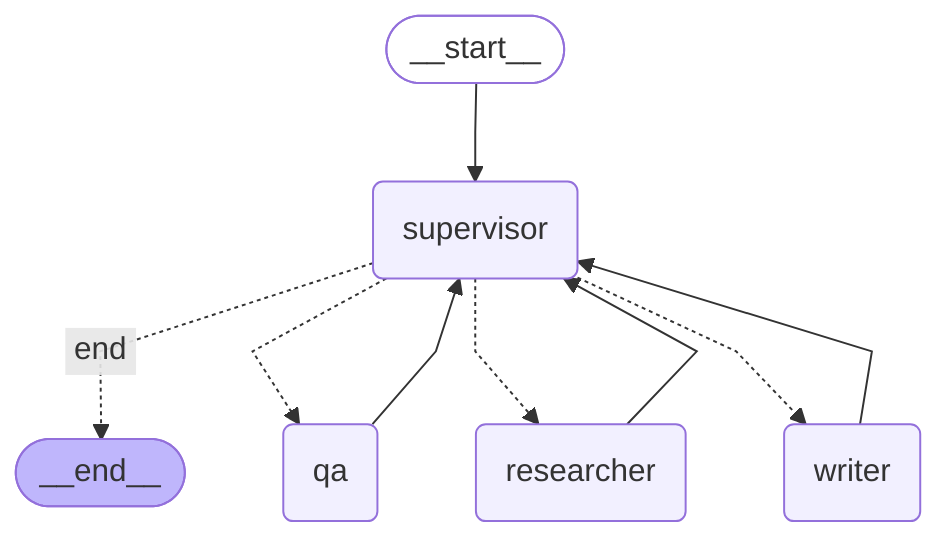

# LangGraph Specialist Swarm 

##  Project Overview
This project implements a **Multi-Agent System** using LangGraph, designed to automate content creation. [cite_start]It solves the limitation of a single LLM by using a "Specialist Swarm" architecture.

The system consists of three specialized agents coordinated by a Supervisor:
* **Researcher:** Gathers facts and key insights.
* **Writer:** Drafts narrative content based on research.
* **QA Engineer:** Reviews the final draft for quality.

##  Architecture Design
[cite_start]The system uses a **State Machine** (Cyclic Graph) where a **Supervisor Node** acts as the router, directing the flow based on the current state (Memory)[cite: 79, 172].

### Architecture Graph
